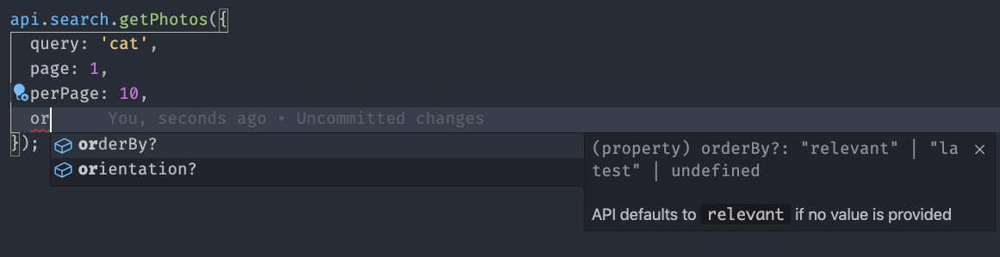
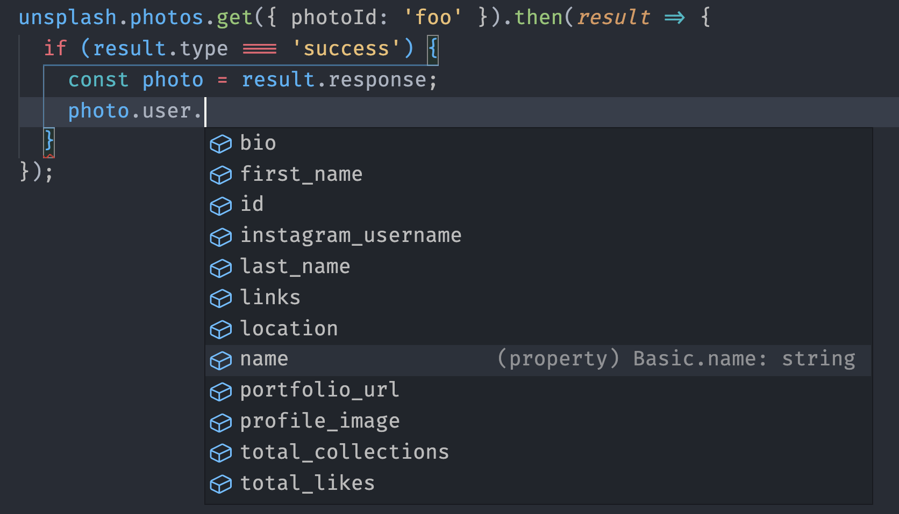

# Unsplash

[](https://www.npmjs.com/package/unsplash-js)

Official Javascript wrapper for the [Unsplash API](https://unsplash.com/developers).

Key Links:

- Before using the Unsplash API, [register as a developer](https://unsplash.com/developers).
- Before using the Unsplash API, read the [API Guidelines](https://help.unsplash.com/api-guidelines/unsplash-api-guidelines). Specifically, you _must_:
  - [hotlink images](https://help.unsplash.com/api-guidelines/more-on-each-guideline/guideline-hotlinking-images)
  - [attribute photographers](https://help.unsplash.com/api-guidelines/more-on-each-guideline/guideline-attribution)
  - [trigger a download when appropriate](https://help.unsplash.com/api-guidelines/more-on-each-guideline/guideline-triggering-a-download)
- Once you create an application and have an access key, go try the demos:
  - [javascript](https://stackblitz.com/edit/unsplash-js-javascript?file=src%2Findex.js)
  - [typescript](https://stackblitz.com/edit/unsplash-js-typescript?file=index.tsx)

## Documentation

- [Installation](#installation)
- [Dependencies](#dependencies)
- [Usage](#usage)
- [Types](#types)
- [Instance Methods](#instance-methods)

## Installation

```bash
$ npm i --save unsplash-js

# OR

$ yarn add unsplash-js
```

## Dependencies

### Fetch

This library depends on [fetch](https://fetch.spec.whatwg.org/) to make requests to the Unsplash API. For environments that don't support fetch, you'll need to provide polyfills of your choosing. Here are the ones we recommend:

- node implementation: [node-fetch](https://github.com/bitinn/node-fetch)
- browser polyfill: [whatwg-fetch](https://github.com/github/fetch)

#### Adding polyfills

`createApi` receives an optional `fetch` parameter. When it is not provided, we rely on the globally scoped `fetch`.

This means that you can set the polyfills in the global scope:

```ts
// server
import fetch from 'node-fetch';
global.fetch = fetch;

// browser
import 'whatwg-fetch';
```

or explicitly provide them as an argument:

```ts
import { createApi } from 'unsplash-js';
import nodeFetch from 'node-fetch';

const unsplash = createApi({
  accessKey: 'MY_ACCESS_KEY',
  fetch: nodeFetch,
});
```

Note: we recommend using a version of `node-fetch` higher than `2.4.0` to benefit from Brotli compression.

#### `node-fetch` and global types

This library presumes that the following types exist in the global namespace:

- `fetch`
- `RequestInit`
- `Response`

By default TypeScript defines these via the `"dom"` type definitions.

However, if you're targeting Node and you're using `node-fetch` you should omit the `"dom"` type definitions using the [`lib` compiler option](https://www.typescriptlang.org/tsconfig#lib) and then define the required global types manually like so:

```ts
import { createApi } from 'unsplash-js';
import * as nodeFetch from 'node-fetch'

declare global {
  var fetch: typeof nodeFetch.default;
  type RequestInit = nodeFetch.RequestInit;
  type Response = nodeFetch.Response;
}
global.fetch = nodeFetch.default;

const unsplash = createApi({
  accessKey: 'MY_ACCESS_KEY',
  fetch: nodeFetch.default,
});
```

Unfortunately this won't work with `node-fetch` v3 due to an issue in `node-fetch`, whereby the global namespace is polluted with the `"dom"` type definitions: https://github.com/node-fetch/node-fetch/issues/1285.

As a workaround you use a type assertion:

```ts
import { createApi } from 'unsplash-js';
import * as nodeFetch from 'node-fetch'

const unsplash = createApi({
  accessKey: 'MY_ACCESS_KEY',
  fetch: nodeFetch.default as unknown as typeof fetch,
});
```

### URL

This library also depends on the WHATWG URL interface:

- MDN [docs](https://developer.mozilla.org/en-US/docs/Web/API/URL) for browsers.
- NodeJS [docs](https://nodejs.org/api/url.html).

Note: Make sure to polyfill this interface if targetting older environments that do not implement it (i.e. Internet Explorer or Node < v8).

Note 2: For Node, the URL interface exists under `require('url').URL` since [v8](https://nodejs.org/es/blog/release/v8.0.0/#say-hello-to-the-whatwg-url-parser) but was only added to the global scope as of [v10.0.0](https://nodejs.org/docs/latest/api/globals.html#globals_url). If you are using a version between v8.0.0 and v10.0.0, you need to add the class to the global scope before using `unsplash-js`:

```js
URL = require('url').URL;
```

## Usage

### Creating an instance

To create an instance, simply provide an _Object_ with your `accessKey`.

NOTE: If you're using `unsplash-js` publicly in the browser, you'll need to proxy your requests through your server to sign the requests with the Access Key to abide by the [API Guideline](https://help.unsplash.com/articles/2511245-unsplash-api-guidelines) to keep keys confidential. We provide an `apiUrl` property that lets you do so. You should only need to provide _one_ of those two values in any given scenario.

```ts
import { createApi } from 'unsplash-js';

// on your node server
const serverApi = createApi({
  accessKey: 'MY_ACCESS_KEY',
  //...other fetch options
});

// in the browser
const browserApi = createApi({
  apiUrl: 'https://mywebsite.com/unsplash-proxy',
  //...other fetch options
});
```

### Making a request

#### Arguments

All methods have 2 arguments: the first one includes all of the specific parameters for that particular endpoint, while the second allows you to pass down any additional options that you want to provide to `fetch`. On top of that, the `createApi` constructor can receive `fetch` options to be added to _every_ request:

```ts
const unsplash = createApi({
  accessKey: 'MY_ACCESS_KEY',
  // `fetch` options to be sent with every request
  headers: { 'X-Custom-Header': 'foo' },
});

unsplash.photos.get(
  { photoId: '123' },
  // `fetch` options to be sent only with _this_ request
  { headers: { 'X-Custom-Header-2': 'bar' } },
);
```

Example: if you would like to implement [request abortion](https://developer.mozilla.org/en-US/docs/Web/API/AbortController), you can do so like this:

```ts
const unsplash = createApi({
  accessKey: 'MY_ACCESS_KEY',
});

const controller = new AbortController();
const signal = controller.signal;

unsplash.photos.get({ photoId: '123' }, { signal }).catch(err => {
  if (err.name === 'AbortError') {
    console.log('Fetch aborted');
  }
});

controller.abort();
```

#### Response

When making a request using this SDK, there are 2 possible outcomes to a request.

- Error: we return a `result.errors` object containing an array of strings (each one representing one error) and `result.source` describing the origin of the error (e.g. `api`, `decoding`). Typically, you will only have on item in this array.
- Success: we return a `result.response` object containing the data.
  - If the request is for a page from a feed, then `result.response.results` will contain the JSON received from API, and `result.response.total` will contain the [`X-total` header value](https://unsplash.com/documentation#per-page-and-total) indicating the total number of items in the feed (not just the page you asked for).
  - If the request is something other than a feed, then `result.response` will contain the JSON received from API

You can inspect which one you have by reading the `result.type` value or checking the contents of `result.errors`/`result.success`

```ts
const unsplash = createApi({ accessKey: 'MY_ACCESS_KEY' });

// non-feed example
unsplash.photos.get({ photoId: 'foo' }).then(result => {
  if (result.errors) {
    // handle error here
    console.log('error occurred: ', result.errors[0]);
  } else {
    // handle success here
    const photo = result.response;
    console.log(photo);
  }
});

// feed example
unsplash.users.getPhotos({ username: 'foo' }).then(result => {
  if (result.errors) {
    // handle error here
    console.log('error occurred: ', result.errors[0]);
  } else {
    const feed = result.response;

    // extract total and results array from response
    const { total, results } = feed;

    // handle success here
    console.log(`received ${results.length} photos out of ${total}`);
    console.log('first photo: ', results[0]);
  }
});
```

NOTE: you can also pattern-match on `result.type` whose value will be `error` or `success`:

```ts
unsplash.photos.get({ photoId: 'foo' }).then(result => {
  switch (result.type) {
    case 'error':
      console.log('error occurred: ', result.errors[0]);
    case 'success':
      const photo = result.response;
      console.log(photo);
  }
});
```

## Types

The types for this library target TypeScript v3.7 and above.

This library is written in TypeScript. This means that even if you are writing plain JavaScript, you can still get useful and accurate type information. We highly recommend that you setup your environment (using an IDE such as [VSCode](https://code.visualstudio.com/)) to fully benefit from this information:

### Function arguments




### Response Types



## Instance Methods

NOTE: All of the method arguments described here are in the first parameter. See the [arguments](#Arguments) section for more information.

- [Search](https://github.com/unsplash/unsplash-js#search)
- [Photos](https://github.com/unsplash/unsplash-js#photos)
- [Users](https://github.com/unsplash/unsplash-js#users)
- [Collections](https://github.com/unsplash/unsplash-js#collections)
- [Topics](https://github.com/unsplash/unsplash-js#topics)

---

<div id="search" />

<div id="search-photos" />

### search.getPhotos(arguments, additionalFetchOptions)

Get a list of photos matching the query. [See endpoint docs 🚀](https://unsplash.com/documentation#search-photos)

**Arguments**

| Argument            | Type     | Optional/Required | Default    |
| ------------------- | -------- | ----------------- | ---------- |
| **`query`**         | _string_ | Required          |            |
| **`page`**          | _number_ | Optional          | 1          |
| **`perPage`**       | _number_ | Optional          | 10         |
| **`orientation`**   | _string_ | Optional          |            |
| **`contentFilter`** | _string_ | Optional          | "low"      |
| **`color`**         | _string_ | Optional          |            |
| **`orderBy`**       | _string_ | Optional          | "relevant" |
| **`collectionIds`** | _array_  | Optional          |            |
| **`lang`**          | _string_ | Optional          | "en"       |

**Example**

```js
unsplash.search.getPhotos({
  query: 'cat',
  page: 1,
  perPage: 10,
  color: 'green',
  orientation: 'portrait',
});
```

### search.getUsers(arguments, additionalFetchOptions)

Get a list of users matching the query. [See endpoint docs 🚀](https://unsplash.com/documentation#search-users)

**Arguments**

| Argument      | Type     | Opt/Required | Default |
| ------------- | -------- | ------------ | ------- |
| **`query`**   | _string_ | Required     |         |
| **`page`**    | _number_ | Optional     | 1       |
| **`perPage`** | _number_ | Optional     | 10      |

**Example**

```js
unsplash.search.getUsers({
  query: 'cat',
  page: 1,
  perPage: 10,
});
```

### search.getCollections(arguments, additionalFetchOptions)

Get a list of collections matching the query. [See endpoint docs 🚀](https://unsplash.com/documentation#search-collections)

**Arguments**

| Argument      | Type     | Opt/Required | Default |
| ------------- | -------- | ------------ | ------- |
| **`query`**   | _string_ | Required     |         |
| **`page`**    | _number_ | Optional     | 1       |
| **`perPage`** | _number_ | Optional     | 10      |

**Example**

```js
unsplash.search.getCollections({
  query: 'cat',
  page: 1,
  perPage: 10,
});
```

---

<div id="photos" />

<div id="photos-all" />

### photos.list(arguments, additionalFetchOptions)

Get a single page from the list of all photos. [See endpoint docs 🚀](https://unsplash.com/documentation#list-photos)

**Arguments**

| Argument      | Type     | Opt/Required | Default  |
| ------------- | -------- | ------------ | -------- |
| **`page`**    | _number_ | Optional     | 1        |
| **`perPage`** | _number_ | Optional     | 10       |
| **`orderBy`** | _string_ | Optional     | `latest` |

**Example**

```js
unsplash.photos.list({});
unsplash.photos.list({ page: 2, perPage: 15 });
```

---

### photos.get(arguments, additionalFetchOptions)

Retrieve a single photo. [See endpoint docs 🚀](https://unsplash.com/documentation#get-a-photo)

**Arguments**

| Argument      | Type     | Opt/Required |
| ------------- | -------- | ------------ |
| **`photoId`** | _string_ | Required     |

**Example**

```js
unsplash.photos.get({ photoId: 'mtNweauBsMQ' });
```

---

### photos.getStats(arguments, additionalFetchOptions)

Retrieve a single photo's stats. [See endpoint docs 🚀](https://unsplash.com/documentation#get-a-photos-statistics)

**Arguments**

| Argument      | Type     | Opt/Required |
| ------------- | -------- | ------------ |
| **`photoId`** | _string_ | Required     |

**Example**

```js
unsplash.photos.getStats({ photoId: 'mtNweauBsMQ' });
```

---

<div id="photo-random" />

### photos.getRandom(arguments, additionalFetchOptions)

Retrieve a single random photo, given optional filters. [See endpoint docs 🚀](https://unsplash.com/documentation#get-a-random-photo). Note: if you provide a value for `count` greater than `1`, you will receive an array of photos. Otherwise, you will receive a single photo object.

**Arguments**

| Argument            | Type            | Opt/Required |
| ------------------- | --------------- | ------------ |
| **`query`**         | _string_        | Optional     |
| **`username`**      | _string_        | Optional     |
| **`featured`**      | _boolean_       | Optional     |
| **`collectionIds`** | _Array<string>_ | Optional     |
| **`topicIds`**      | _Array<string>_ | Optional     |
| **`count`**         | _string_        | Optional     |

**Example**

```js
unsplash.photos.getRandom({});
unsplash.photos.getRandom({
  count: 10,
});
unsplash.photos.getRandom({
  collectionIds: ['abc123'],
  topicIds: ['def456'],
  featured: true,
  username: 'naoufal',
  query: 'dog',
  count: 1,
});
```

<div id="track-download" />

### photos.trackDownload(arguments, additionalFetchOptions)

Trigger a download of a photo as per the [download tracking requirement of API Guidelines](https://medium.com/unsplash/unsplash-api-guidelines-triggering-a-download-c39b24e99e02). [See endpoint docs 🚀](https://unsplash.com/documentation#track-a-photo-download)

**Arguments**

| Argument               | Type     | Opt/Required |
| ---------------------- | -------- | ------------ |
| **`downloadLocation`** | _string_ | Required     |

**Example**

```js
unsplash.photos.get({ photoId: 'mtNweauBsMQ' }).then(result => {
  if (result.type === 'success') {
    const photo = result.response;
    unsplash.photos.trackDownload({
      downloadLocation: photo.links.download_location,
    });
  }
});

// or if working with an array of photos
unsplash.search.photos({ query: 'dogs' }).then(result => {
  if (result.type === 'success') {
    const firstPhoto = result.response.results[0];
    unsplash.photos.trackDownload({
      downloadLocation: firstPhoto.links.download_location,
    });
  }
});
```

---

<div id="users" />

### users.get(username)

Retrieve public details on a given user. [See endpoint docs 🚀](https://unsplash.com/documentation#get-a-users-public-profile)

**Arguments**

| Argument       | Type     | Opt/Required |
| -------------- | -------- | ------------ |
| **`username`** | _string_ | Required     |

**Example**

```js
unsplash.users.get({ username: 'naoufal' });
```

---

### users.getPhotos(arguments, additionalFetchOptions)

Get a list of photos uploaded by a user. [See endpoint docs 🚀](https://unsplash.com/documentation#list-a-users-photos)

**Arguments**

| Argument          | Type      | Opt/Required | Notes                               | Default  |
| ----------------- | --------- | ------------ | ----------------------------------- | -------- |
| **`username`**    | _string_  | Required     |                                     |          |
| **`page`**        | _number_  | Optional     |                                     | 1        |
| **`perPage`**     | _number_  | Optional     |                                     | 10       |
| **`orderBy`**     | _string_  | Optional     | `latest`, `oldest`                  | `latest` |
| **`stats`**       | _boolean_ | Optional     |                                     | `false`  |
| **`orientation`** | _string_  | Optional     | `landscape`, `portrait`, `squarish` |          |

**Example**

```js
unsplash.users.getPhotos({
  username: 'naoufal',
  page: 1,
  perPage: 10,
  orderBy: 'latest',
  orientation: 'landscape',
});
```

---

### users.getLikes(arguments, additionalFetchOptions)

Get a list of photos liked by a user. [See endpoint docs 🚀](https://unsplash.com/documentation#list-a-users-liked-photos)

**Arguments**

| Argument          | Type     | Opt/Required | Notes                               | Default  |
| ----------------- | -------- | ------------ | ----------------------------------- | -------- |
| **`username`**    | _string_ | Required     |                                     |          |
| **`page`**        | _number_ | Optional     |                                     | 1        |
| **`perPage`**     | _number_ | Optional     |                                     | 10       |
| **`orderBy`**     | _string_ | Optional     | `latest`, `oldest`                  | `latest` |
| **`orientation`** | _string_ | Optional     | `landscape`, `portrait`, `squarish` |          |

**Example**

```js
unsplash.users.getLikes({
  username: 'naoufal',
  page: 1,
  perPage: 10,
  orderBy: 'latest',
  orientation: 'landscape',
});
```

---

### users.getCollections(arguments, additionalFetchOptions)

Get a list of collections created by the user. [See endpoint docs 🚀](https://unsplash.com/documentation#list-a-users-collections)

**Arguments**

| Argument       | Type     | Opt/Required | Notes | Default |
| -------------- | -------- | ------------ | ----- | ------- |
| **`username`** | _string_ | Required     |       |         |
| **`page`**     | _number_ | Optional     |       | 1       |
| **`perPage`**  | _number_ | Optional     |       | 10      |

**Example**

```js
unsplash.users.getCollections({
  username: 'naoufal',
  page: 2,
  perPage: 15,
});
```

---

<div id="collections" />

### collections.list(arguments, additionalFetchOptions)

Get a single page from the list of all collections. [See endpoint docs 🚀](https://unsplash.com/documentation#list-collections)

**Arguments**

| Argument      | Type     | Opt/Required | Notes | Default |
| ------------- | -------- | ------------ | ----- | ------- |
| **`page`**    | _number_ | Optional     |       | 1       |
| **`perPage`** | _number_ | Optional     |       | 10      |

**Example**

```js
unsplash.collections.list({ page: 1, perPage: 10 });
```

---

### collections.get(arguments, additionalFetchOptions)

Retrieve a single collection. [See endpoint docs 🚀](https://unsplash.com/documentation#get-a-collection)

**Arguments**

| Argument           | Type     | Opt/Required |
| ------------------ | -------- | ------------ |
| **`collectionId`** | _string_ | Required     |

**Example**

```js
unsplash.collections.get({ collectionId: 'abc123' });
```

---

### collections.getPhotos(arguments, additionalFetchOptions)

Retrieve a collection’s photos. [See endpoint docs 🚀](https://unsplash.com/documentation#get-a-collections-photos)

**Arguments**

| Argument           | Type     | Opt/Required | Notes                               | Default  |
| ------------------ | -------- | ------------ | ----------------------------------- | -------- |
| **`collectionId`** | _string_ | Required     |                                     |          |
| **`page`**         | _number_ | Optional     |                                     | 1        |
| **`perPage`**      | _number_ | Optional     |                                     | 10       |
| **`orderBy`**      | _string_ | Optional     | `latest`, `oldest`                  | `latest` |
| **`orientation`**  | _string_ | Optional     | `landscape`, `portrait`, `squarish` |          |

**Example**

```js
unsplash.collections.getPhotos({ collectionId: 'abc123' });
```

---

### collections.getRelated(arguments, additionalFetchOptions)

Lists collections related to the provided one. [See endpoint docs 🚀](https://unsplash.com/documentation#list-a-collections-related-collections)

**Arguments**

| Argument           | Type     | Opt/Required |
| ------------------ | -------- | ------------ |
| **`collectionId`** | _string_ | Required     |

**Example**

```js
unsplash.collections.getRelated({ collectionId: 'abc123' });
```

---

## Topics

### topics.list(arguments, additionalFetchOptions)

Get a single page from the list of all topics. [See endpoint docs 🚀](https://unsplash.com/documentation#list-topics)

**Arguments**

| Argument              | Type            | Opt/Required | Notes                                      | Default    |
| --------------------- | --------------- | ------------ | ------------------------------------------ | ---------- |
| **`topicIdsOrSlugs`** | _Array<string>_ | Optional     |                                            | []         |
| **`page`**            | _number_        | Optional     |                                            | 1          |
| **`perPage`**         | _number_        | Optional     |                                            | 10         |
| **`orderBy`**         | _string_        | Optional     | `latest`, `oldest`, `featured`, `position` | `position` |

**Example**

```js
unsplash.topics.list({
  page: 1,
  perPage: 10,
  topicIdsOrSlugs: ['fashion', 'architecture', '6sMVjTLSkeQ'],
});
```

---

### topics.get(arguments, additionalFetchOptions)

Retrieve a single topic. [See endpoint docs 🚀](https://unsplash.com/documentation#get-a-topic)

**Arguments**

| Argument            | Type     | Opt/Required |
| ------------------- | -------- | ------------ |
| **`topicIdOrSlug`** | _string_ | Required     |

**Example**

```js
unsplash.topics.get({ topicIdOrSlug: 'abc123' });
```

---

### topics.getPhotos(arguments, additionalFetchOptions)

Retrieve a topic’s photos. [See endpoint docs 🚀](https://unsplash.com/documentation#get-a-topics-photos)

**Arguments**

| Argument            | Type     | Opt/Required | Notes                               | Default  |
| ------------------- | -------- | ------------ | ----------------------------------- | -------- |
| **`topicIdOrSlug`** | _string_ | Required     |                                     |          |
| **`page`**          | _number_ | Optional     |                                     | 1        |
| **`perPage`**       | _number_ | Optional     |                                     | 10       |
| **`orderBy`**       | _string_ | Optional     | `latest`, `oldest`, `popular`       | `latest` |
| **`orientation`**   | _string_ | Optional     | `landscape`, `portrait`, `squarish` |          |

**Example**

```js
unsplash.topics.getPhotos({ topicIdOrSlug: 'abc123' });
```
