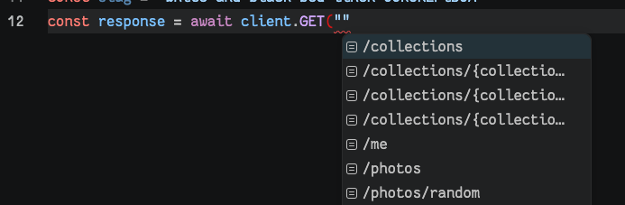
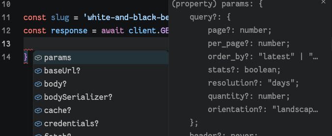
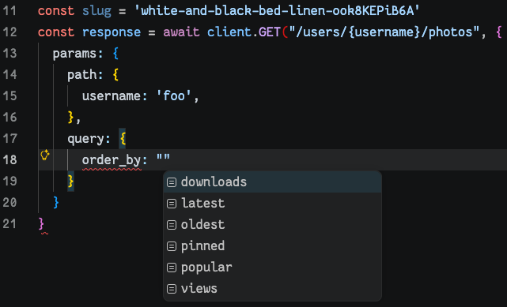
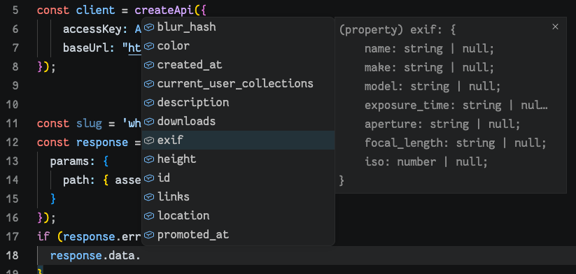

# Unsplash

[](https://www.npmjs.com/package/unsplash-js)

Official JavaScript wrapper for the [Unsplash API](https://unsplash.com/developers).

Key Links:

- Before using the Unsplash API, [register as a developer](https://unsplash.com/developers).
- Before using the Unsplash API, read the [API Guidelines](https://help.unsplash.com/api-guidelines/unsplash-api-guidelines). Specifically, you _must_:
  - [hotlink images](https://help.unsplash.com/api-guidelines/more-on-each-guideline/guideline-hotlinking-images)
  - [attribute photographers](https://help.unsplash.com/api-guidelines/more-on-each-guideline/guideline-attribution)
  - [trigger a download when appropriate](https://help.unsplash.com/api-guidelines/more-on-each-guideline/guideline-triggering-a-download)
- Once you create an application and have an access key, go try the demos:
  - [typescript](https://stackblitz.com/edit/unsplash-js-hq6lrpxm?file=src%2Fmain.tsx)

## Documentation

- [Installation](#installation)
- [Usage](#usage)
- [Replacing fetch](#replacing-fetch)
- [Types](#types)
- [Endpoint examples](#endpoint-examples)

## Installation

```bash
$ npm i --save unsplash-js

# OR

$ yarn add unsplash-js

# OR

$ pnpm add unsplash-js
```

## Usage

### Creating an instance

To create an instance, simply provide an `Object` with your `accessKey`.

```ts
import { createApi } from "unsplash-js";

// on your node server
const serverApi = createApi({
  accessKey: "MY_ACCESS_KEY",
  //...other fetch options
});

// in the browser
const browserApi = createApi({
  baseUrl: "https://mywebsite.com/unsplash-proxy",
  //...other fetch options
});
```

**NOTE: If you're using `unsplash-js` in the browser, you must proxy your requests through your server by setting `baseUrl`. This is to authenticate requests with your Access Key to abide by the [API Guideline](https://help.unsplash.com/en/articles/2511245-unsplash-api-guidelines), and keeps your keys confidential. If `baseUrl` is set, `accessKey` is unnecessary and vice-versa.**

### Making a request

`createApi` returns an instance whose methods each accept a `params` object and standard `fetch` options.

Each method is named after an HTTP verb (GET, POST, DELETE, PUT, PATCH).

```ts
const unsplash = createApi({
  accessKey: "MY_ACCESS_KEY",
});

unsplash.GET("/photos/{assetSlug}", {
  params: { path: { assetSlug: "123" } },
});
```

Global `fetch` options can be set on the constructor; per-request `fetch` options override them:

```ts
const unsplash = createApi({
  accessKey: "MY_ACCESS_KEY",
  // `fetch` options to be sent with every request
  headers: { "X-Custom-Header": "foo" },
});

unsplash.GET("/photos/{assetSlug}", {
  params: { path: { assetSlug: "123" } },
  // `fetch` options to be sent with only this request
  headers: { "X-Custom-Header-2": "bar" },
});
```

Example: Using an [AbortController](https://developer.mozilla.org/en-US/docs/Web/API/AbortController) on a specific request:

```ts
const unsplash = createApi({
  accessKey: "MY_ACCESS_KEY",
});

const controller = new AbortController();
const signal = controller.signal;

unsplash
  .GET("/photos/{assetSlug}", {
    params: { path: { assetSlug: "123" } },
    signal,
  })
  .catch((err) => {
    if (err.name === "AbortError") {
      console.log("Fetch aborted");
    }
  });

controller.abort();
```

#### Response

There are two possible outcomes to a request:

1. You received data: `result.data` is present and populated.
2. The server returned an error: `result.error` is present and contains error details.

If you'd like to inspect the full response, `result.response` contains the raw `Response` object. You can use this to get the `X-Total` header value on feed responses, for example.

```ts
const unsplash = createApi({ accessKey: "MY_ACCESS_KEY" });

// non-feed example
const result = await unsplash.GET("/photos/{assetSlug}", {
  params: { path: { assetSlug: "foo" } },
});

if (result.error) {
  // handle error here
  console.log("error occurred: ", result.error.errors[0]);
} else {
  // handle success here
  const photo = result.data;
  console.log(photo);
}

// feed example
const result = await unsplash.GET("/users/{username}/photos", {
  params: { path: { username: "foo" } },
});

if (result.error) {
  // handle error here
  console.log("error occurred: ", result.error.errors[0]);
} else {
  // extract total and results array from response
  const feed = result.data;
  const total = parseInt(result.response.headers.get("x-total"));

  // handle success here
  console.log(`received ${feed.length} photos out of ${total}`);
  console.log("first photo: ", feed[0]);
}
```

**NOTE: All [usual fetch exceptions](https://developer.mozilla.org/en-US/docs/Web/API/Window/fetch#exceptions) can get thrown when making requests using this library.**

#### Authentication

When using the `accessKey` parameter on the `createApi` constructor, the `Authorization` header will be automatically set to use [public authentication](https://unsplash.com/documentation#public-authentication).

If you need to use either the [user authentication](https://unsplash.com/documentation#user-authentication) or [dynamic client registration](https://unsplash.com/documentation#dynamic-client-registration) scheme, set the `Authorization` header on each request according to the requirements of the authentication method you've chosen.

### Replacing fetch

This is useful when mocking fetch in tests, targeting an older runtime, or providing a custom fetch implementation.

Fetch can be replaced globally or as an argument to `createApi`.

```ts
// Globally

// server
import fetch from "node-fetch";
global.fetch = fetch;

// browser
import "whatwg-fetch";
```

```ts
// As an argument to `createApi`

import { createApi } from "unsplash-js";
import nodeFetch from "node-fetch";

const unsplash = createApi({
  accessKey: "MY_ACCESS_KEY",
  fetch: nodeFetch,
});
```

See the openapi-fetch [documentation](https://openapi-ts.dev/openapi-fetch/testing) for more information.

## Types

The types for this library target TypeScript v4.5 and above.

This library is written in TypeScript, which means that even if you are writing plain JavaScript, you can still get useful and accurate type information. We highly recommend that you setup your environment (using an editor such as [VSCode](https://code.visualstudio.com/)) to fully benefit from type hinting:

### Request completion





### Response completion



## Endpoint examples

`createApi` returns a preconfigured [`openapi-fetch`](https://openapi-ts.dev/openapi-fetch/) instance whose methods correspond to the usual HTTP verbs (`.GET`, `.POST`, `.PUT`, `.DELETE`, `.PATCH`).

For a full list of Unsplash's public endpoints, see the [API documentation](https://unsplash.com/documentation).

The endpoints covered here are grouped by category:

- [Search](https://github.com/unsplash/unsplash-js#search)
- [Photos](https://github.com/unsplash/unsplash-js#photos)
- [Users](https://github.com/unsplash/unsplash-js#users)
- [Collections](https://github.com/unsplash/unsplash-js#collections)
- [Topics](https://github.com/unsplash/unsplash-js#topics)

For a full list of all available endpoints and their parameters, see [the OpenAPI spec](https://editor.swagger.io/?url=https://unsplash.com/spec/v1.json).

---

<div id="search" />

<div id="search-photos" />

### `.GET("/search/photos", { params: { ... }})`

Get a list of photos matching the query. [See endpoint docs 🚀](https://unsplash.com/documentation#search-photos)

**Parameters**

| Parameter            | Location | Type                                      | Optional/Required | Default    | Note                                                       |
| -------------------- | -------- | ----------------------------------------- | ----------------- | ---------- | ---------------------------------------------------------- |
| **`query`**          | query    | _string_                                  | Required          |            |                                                            |
| **`page`**           | query    | _number_                                  | Optional          | 1          |                                                            |
| **`per_page`**       | query    | _number_                                  | Optional          | 10         |                                                            |
| **`orientation`**    | query    | _"portrait" \| "landscape" \| "squarish"_ | Optional          |            |                                                            |
| **`content_filter`** | query    | _"low" \| "high"_                         | Optional          | "low"      |                                                            |
| **`color`**          | query    | _string_                                  | Optional          |            | see https://unsplash.com/documentation#search-photos       |
| **`order_by`**       | query    | _"latest" \| "relevant"_                  | Optional          | "relevant" |                                                            |
| **`collections`**    | query    | _Array<string>_                           | Optional          |            |                                                            |
| **`lang`**           | query    | _string_                                  | Optional          | "en"       | see https://unsplash.com/documentation#supported-languages |

**Example**

```ts
const { data, error } = await unsplash.GET("/search/photos", {
  params: {
    query: {
      query: "cat",
      page: 1,
      per_page: 10,
      color: "green",
      orientation: "portrait",
    },
  },
});
```

### `.GET("/search/users", { params: { ... }})`

Get a list of users matching the query. [See endpoint docs 🚀](https://unsplash.com/documentation#search-users)

**Parameters**

| Parameter      | Location | Type     | Optional/Required | Default |
| -------------- | -------- | -------- | ----------------- | ------- |
| **`query`**    | query    | _string_ | Required          |         |
| **`page`**     | query    | _number_ | Optional          | 1       |
| **`per_page`** | query    | _number_ | Optional          | 10      |

**Example**

```ts
const { data, error } = await unsplash.GET("/search/users", {
  params: {
    query: {
      query: "cat",
      page: 1,
      per_page: 10,
    },
  },
});
```

### `.GET("/search/collections", { params: { ... }})`

Get a list of collections matching the query. [See endpoint docs 🚀](https://unsplash.com/documentation#search-collections)

**Parameters**

| Parameter      | Location | Type     | Optional/Required | Default |
| -------------- | -------- | -------- | ----------------- | ------- |
| **`query`**    | query    | _string_ | Required          |         |
| **`page`**     | query    | _number_ | Optional          | 1       |
| **`per_page`** | query    | _number_ | Optional          | 10      |

**Example**

```ts
const { data, error } = await unsplash.GET("/search/collections", {
  params: {
    query: {
      query: "cat",
      page: 1,
      per_page: 10,
    },
  },
});
```

---

<div id="photos" />

<div id="photos-all" />

### `.GET("/photos", { params: { ... }})`

Get a single page from the list of all photos. [See endpoint docs 🚀](https://unsplash.com/documentation#list-photos)

**Parameters**

| Parameter      | Location | Type     | Optional/Required | Default |
| -------------- | -------- | -------- | ----------------- | ------- |
| **`page`**     | query    | _number_ | Optional          | 1       |
| **`per_page`** | query    | _number_ | Optional          | 10      |

**Example**

```ts
const { data, error } = await unsplash.GET("/photos", {
  params: {
    query: { page: 2, per_page: 15 },
  },
});
```

---

### `.GET("/photos/{assetSlug}", { params: { ... }})`

Retrieve a single photo. [See endpoint docs 🚀](https://unsplash.com/documentation#get-a-photo)

**Parameters**

| Parameter       | Location | Type     | Optional/Required |
| --------------- | -------- | -------- | ----------------- |
| **`assetSlug`** | path     | _string_ | Required          |

**Example**

```ts
const { data, error } = await unsplash.GET("/photos/{assetSlug}", {
  params: {
    path: { assetSlug: "mtNweauBsMQ" },
  },
});
```

---

### `.GET("/photos/{assetSlug}/statistics", { params: { ... }})`

Retrieve a single photo's stats. [See endpoint docs 🚀](https://unsplash.com/documentation#get-a-photos-statistics)

**Parameters**

| Parameter        | Location | Type     | Optional/Required | Default |
| ---------------- | -------- | -------- | ----------------- | ------- |
| **`assetSlug`**  | path     | _string_ | Required          |         |
| **`resolution`** | query    | _"days"_ | Optional          | "days"  |
| **`quantity`**   | query    | _number_ | Optional          | 30      |

**Example**

```ts
const { data, error } = await unsplash.GET("/photos/{assetSlug}/statistics", {
  params: {
    path: { assetSlug: "mtNweauBsMQ" },
    query: {
      resolution: "days",
      quantity: 30,
    },
  },
});
```

---

<div id="photo-random" />

### `.GET("/photos/random", { params: { ... }})`

Retrieve a single random photo, given optional filters. [See endpoint docs 🚀](https://unsplash.com/documentation#get-a-random-photo). Note: if you provide a value for `count` greater than `1`, you will receive an array of photos. Otherwise, you will receive a single photo object.

**Parameters**

| Parameter            | Location | Type                                      | Optional/Required | Default |
| -------------------- | -------- | ----------------------------------------- | ----------------- | ------- |
| **`count`**          | query    | _number_                                  | Optional          | 1       |
| **`collections`**    | query    | _Array<string>_                           | Optional          |         |
| **`topics`**         | query    | _Array<string>_                           | Optional          |         |
| **`username`**       | query    | _string_                                  | Optional          |         |
| **`orientation`**    | query    | _"portrait" \| "landscape" \| "squarish"_ | Optional          |         |
| **`content_filter`** | query    | _"low" \| "high"_                         | Optional          | "low"   |
| **`query`**          | query    | _string_                                  | Optional          |         |

**Example**

```ts
const { data, error } = await unsplash.GET("/photos/random", {
  params: {
    query: {
      collections: ["abc123"],
      topics: ["def456"],
      username: "naoufal",
      query: "dog",
      count: 1,
    },
  },
});
```

---

<div id="track-download" />

### `.GET("/photos/{id}/download", { params: { ... }})`

Trigger a download of a photo as per the [download tracking requirement of API Guidelines](https://medium.com/unsplash/unsplash-api-guidelines-triggering-a-download-c39b24e99e02). [See endpoint docs 🚀](https://unsplash.com/documentation#track-a-photo-download)

**Parameters**

| Parameter | Location | Type     | Optional/Required |
| --------- | -------- | -------- | ----------------- |
| **`id`**  | path     | _string_ | Required          |

**Example**

```ts
const photoResult = await unsplash.GET("/photos/{assetSlug}", {
  params: {
    path: { assetSlug: "mtNweauBsMQ" },
  },
});

if (photoResult.data) {
  await unsplash.GET("/photos/{id}/download", {
    params: {
      path: { id: photoResult.data.id },
    },
  });
}

// or if working with an array of photos
const searchResult = await unsplash.GET("/search/photos", {
  params: {
    query: { query: "dogs" },
  },
});

if (searchResult.data) {
  const firstPhoto = searchResult.data.results[0];

  await unsplash.GET("/photos/{id}/download", {
    params: {
      path: { id: firstPhoto.id },
    },
  });
}
```

---

<div id="users" />

### `.GET("/users/{username}", { params: { ... }})`

Retrieve public details on a given user. [See endpoint docs 🚀](https://unsplash.com/documentation#get-a-users-public-profile)

**Parameters**

| Parameter      | Location | Type     | Optional/Required |
| -------------- | -------- | -------- | ----------------- |
| **`username`** | path     | _string_ | Required          |

**Example**

```ts
const { data, error } = await unsplash.GET("/users/{username}", {
  params: {
    path: { username: "naoufal" },
  },
});
```

---

### `.GET("/users/{username}/photos", { params: { ... }})`

Get a list of photos uploaded by a user. [See endpoint docs 🚀](https://unsplash.com/documentation#list-a-users-photos)

**Parameters**

| Parameter         | Location | Type                                                         | Optional/Required | Default  |
| ----------------- | -------- | ------------------------------------------------------------ | ----------------- | -------- |
| **`username`**    | path     | _string_                                                     | Required          |          |
| **`page`**        | query    | _number_                                                     | Optional          | 1        |
| **`per_page`**    | query    | _number_                                                     | Optional          | 10       |
| **`order_by`**    | query    | _"latest" \| "oldest" \| "popular" \| "views" \| "download"_ | Optional          | "latest" |
| **`stats`**       | query    | _boolean_                                                    | Optional          | false    |
| **`resolution`**  | query    | _"days"_                                                     | Optional          | "days"   |
| **`quantity`**    | query    | _number_                                                     | Optional          | 30       |
| **`orientation`** | query    | _"portrait" \| "landscape" \| "squarish"_                    | Optional          |          |

**Example**

```ts
const { data, error } = await unsplash.GET("/users/{username}/photos", {
  params: {
    path: { username: "naoufal" },
    query: {
      page: 1,
      per_page: 10,
      order_by: "latest",
      orientation: "landscape",
    },
  },
});
```

---

### `.GET("/users/{username}/collections", { params: { ... }})`

Get a list of collections created by the user. [See endpoint docs 🚀](https://unsplash.com/documentation#list-a-users-collections)

**Parameters**

| Parameter      | Location | Type     | Optional/Required | Default |
| -------------- | -------- | -------- | ----------------- | ------- |
| **`username`** | path     | _string_ | Required          |         |
| **`page`**     | query    | _number_ | Optional          | 1       |
| **`per_page`** | query    | _number_ | Optional          | 10      |

**Example**

```ts
const { data, error } = await unsplash.GET("/users/{username}/collections", {
  params: {
    path: { username: "naoufal" },
    query: {
      page: 2,
      per_page: 15,
    },
  },
});
```

---

<div id="collections" />

### `.GET("/collections", { params: { ... }})`

Get a single page from the list of all collections. [See endpoint docs 🚀](https://unsplash.com/documentation#list-collections)

**Parameters**

| Parameter      | Location | Type     | Optional/Required | Default |
| -------------- | -------- | -------- | ----------------- | ------- |
| **`page`**     | query    | _number_ | Optional          | 1       |
| **`per_page`** | query    | _number_ | Optional          | 10      |

**Example**

```ts
const { data, error } = await unsplash.GET("/collections", {
  params: {
    query: { page: 1, per_page: 10 },
  },
});
```

---

### `.GET("/collections/{collectionId}", { params: { ... }})`

Retrieve a single collection. [See endpoint docs 🚀](https://unsplash.com/documentation#get-a-collection)

**Parameters**

| Parameter          | Location | Type     | Optional/Required |
| ------------------ | -------- | -------- | ----------------- |
| **`collectionId`** | path     | _string_ | Required          |

**Example**

```ts
const { data, error } = await unsplash.GET("/collections/{collectionId}", {
  params: {
    path: { collectionId: "abc123" },
  },
});
```

---

### `.GET("/collections/{collectionId}/photos", { params: { ... }})`

Retrieve a collection’s photos. [See endpoint docs 🚀](https://unsplash.com/documentation#get-a-collections-photos)

**Parameters**

| Parameter          | Location | Type                                      | Optional/Required | Default |
| ------------------ | -------- | ----------------------------------------- | ----------------- | ------- |
| **`collectionId`** | path     | _string_                                  | Required          |         |
| **`page`**         | query    | _number_                                  | Optional          | 1       |
| **`per_page`**     | query    | _number_                                  | Optional          | 10      |
| **`orientation`**  | query    | _"portrait" \| "landscape" \| "squarish"_ | Optional          |         |

**Example**

```ts
const { data, error } = await unsplash.GET("/collections/{collectionId}/photos", {
  params: {
    path: { collectionId: "abc123" },
    query: {
      page: 1,
      per_page: 10,
      orientation: "landscape",
    },
  },
});
```

---

### `.GET("/collections/{collectionId}/related", { params: { ... }})`

Lists collections related to the provided one. [See endpoint docs 🚀](https://unsplash.com/documentation#list-a-collections-related-collections)

**Parameters**

| Parameter          | Location | Type     | Optional/Required |
| ------------------ | -------- | -------- | ----------------- |
| **`collectionId`** | path     | _string_ | Required          |

**Example**

```ts
const { data, error } = await unsplash.GET("/collections/{collectionId}/related", {
  params: {
    path: { collectionId: "abc123" },
  },
});
```

---

<div id="topics" />

### `.GET("/topics", { params: { ... }})`

Get a single page from the list of all topics. [See endpoint docs 🚀](https://unsplash.com/documentation#list-topics)

**Parameters**

| Parameter      | Location | Type                                               | Optional/Required | Default    |
| -------------- | -------- | -------------------------------------------------- | ----------------- | ---------- |
| **`page`**     | query    | _number_                                           | Optional          | 1          |
| **`per_page`** | query    | _number_                                           | Optional          | 10         |
| **`order_by`** | query    | _"featured" \| "latest" \| "oldest" \| "position"_ | Optional          | "position" |
| **`ids`**      | query    | _Array<string>_                                    | Optional          |            |

**Example**

```ts
const { data, error } = await unsplash.GET("/topics", {
  params: {
    query: {
      page: 1,
      per_page: 10,
      ids: ["fashion", "architecture", "6sMVjTLSkeQ"],
    },
  },
});
```

---

### `.GET("/topics/{topicSlug}", { params: { ... }})`

Retrieve a single topic. [See endpoint docs 🚀](https://unsplash.com/documentation#get-a-topic)

**Parameters**

| Parameter       | Location | Type     | Optional/Required |
| --------------- | -------- | -------- | ----------------- |
| **`topicSlug`** | path     | _string_ | Required          |

**Example**

```ts
const { data, error } = await unsplash.GET("/topics/{topicSlug}", {
  params: {
    path: { topicSlug: "wallpapers" },
  },
});
```

---

### `.GET("/topics/{topicSlug}/photos", { params: { ... }})`

Retrieve a topic’s photos. [See endpoint docs 🚀](https://unsplash.com/documentation#get-a-topics-photos)

**Parameters**

| Parameter         | Location | Type                                      | Optional/Required | Default  |
| ----------------- | -------- | ----------------------------------------- | ----------------- | -------- |
| **`topicSlug`**   | path     | _string_                                  | Required          |          |
| **`page`**        | query    | _number_                                  | Optional          | 1        |
| **`per_page`**    | query    | _number_                                  | Optional          | 10       |
| **`orientation`** | query    | _"portrait" \| "landscape" \| "squarish"_ | Optional          |          |
| **`order_by`**    | query    | _"latest" \| "oldest" \| "popular"_       | Optional          | "latest" |

**Example**

```ts
const { data, error } = await unsplash.GET("/topics/{topicSlug}/photos", {
  params: {
    path: { topicSlug: "wallpapers" },
    query: {
      page: 1,
      per_page: 10,
      order_by: "latest",
      orientation: "landscape",
    },
  },
});
```
